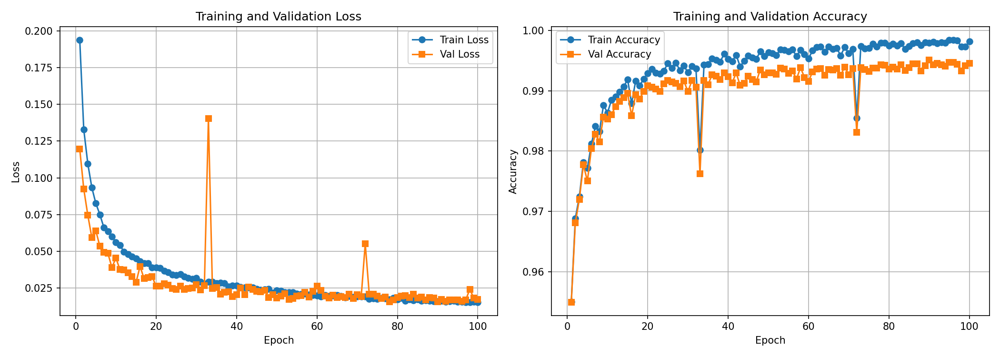

# Fall Detection on Wearable Devices

[](https://www.python.org/downloads/)
[](https://pytorch.org/)
[](https://opensource.org/licenses/MIT)

A deep learning project for detecting falls in real-time on wearable devices using accelerometer and gyroscope data from the **SisFall dataset**. This model achieves **~99% accuracy** and is optimized for deployment on mobile and IoT devices.

## 🎯 Project Overview

This project trains a lightweight **1D Convolutional Neural Network (CNN)** to classify human movements into two categories:
- **Falls (F)**: Sudden loss of balance or controlled descent events
- **Activities of Daily Living (ADL)**: Normal daily activities like walking, sitting, lying down, etc.

The model processes 6-channel IMU data (3-axis accelerometer + 3-axis gyroscope) in 1-second windows sampled at 200 Hz, making it suitable for real-time inference on edge devices.

## 📊 Training Results

The model was trained for 50+ epochs on the SisFall dataset and achieved excellent performance:

| Metric | Value |
|--------|-------|
| **Training Accuracy** | 99.65% |
| **Validation Accuracy** | 99.34% |
| **Test Accuracy** | ~99% |
| **Training Loss** | 0.022 |
| **Validation Loss** | 0.019 |

### Training Curves



The plots above show:
- **Left**: Loss decreases consistently across training and validation sets
- **Right**: Accuracy quickly plateaus near 99% and remains stable throughout training

## 🗂️ Dataset: SisFall

The **SisFall (Fall Detection Dataset)** is a comprehensive benchmark dataset containing:
- **34 subjects**: 15 SA (Subjects Adults) + 19 SE (Subjects Elderly)
- **15 fall types**: Different fall scenarios (forward, backward, lateral, etc.)
- **16 ADL types**: Normal activities like walking, sitting, lying, picking up objects
- **Multiple repetitions**: Each subject performs each activity/fall 5 times
- **IMU sampling**: 200 Hz with 3-axis accelerometer and 3-axis gyroscope
- **Total signals**: 1,000+ recordings

### Data Preprocessing
- **Windowing**: Sliding windows of 200 samples (1 second) with 50% overlap
- **Normalization**: Z-score normalization per channel (mean 0, std 1)
- **Train/Val/Test split**: 70% / 20% / 10%

## 🧠 Model Architecture

A lightweight 1D CNN designed for mobile deployment:

```
Input: (Batch, 6 channels, 200 samples)
  ↓
Conv1d(6 → 32, kernel=7) + BatchNorm + ReLU + MaxPool
  ↓
Conv1d(32 → 64, kernel=5) + BatchNorm + ReLU + MaxPool
  ↓
Conv1d(64 → 128, kernel=3) + BatchNorm + ReLU + AdaptiveAvgPool
  ↓
Linear(128 → 64) + ReLU + Dropout(0.3)
  ↓
Linear(64 → 2)  [Fall vs Non-Fall]
  ↓
Output: Binary classification logits
```

**Model Size**: ~28K parameters (very lightweight for edge deployment)

## 🚀 Quick Start

### Installation

1. **Clone the repository**:
   ```bash
   git clone https://github.com/yourusername/fsos_ring.git
   cd fsos_ring
   ```

2. **Create a virtual environment** (optional but recommended):
   ```bash
   python3 -m venv venv
   source venv/bin/activate  # On Windows: venv\Scripts\activate
   ```

3. **Install dependencies**:
   ```bash
   pip install -r requirements.txt
   ```

### Download Dataset

The SisFall dataset is not included in this repository. Download it from:
- **Official source**: [SisFall Dataset](https://archive.ics.uci.edu/ml/datasets/sisfall)

After downloading, extract it to `datasets/SisFall_dataset/` or modify `SISFALL_ROOT` in `model.py`.

### Training

Train the model with default settings:
```bash
python train.py --epochs 50 --batch-size 64 --lr 1e-3
```

**Available arguments**:
```
--epochs          Number of training epochs (default: 1)
--batch-size      Batch size for training (default: 64)
--lr              Learning rate (default: 1e-3)
--save-dir        Directory to save model & metrics (default: .)
--device          Device to use: 'auto', 'cpu', or 'cuda' (default: auto)
--log-interval    Batches between log messages (default: 50)
```

Example with CUDA:
```bash
python train.py --epochs 50 --batch-size 64 --lr 1e-3 --device cuda --save-dir ./outputs
```

### Outputs

After training, you'll find:
- `best_model.pth`: Trained model weights (best validation accuracy)
- `metrics.csv`: Training metrics for all epochs
- `metrics_plot.png`: Visualization of loss and accuracy curves

## 📈 Key Features

✅ **High Accuracy**: ~99% detection rate on SisFall dataset  
✅ **Lightweight**: Only ~28K parameters for mobile deployment  
✅ **Fast Inference**: Processes 1-second windows in milliseconds  
✅ **Real-time Capable**: Ready for edge device deployment  
✅ **Reproducible**: Fixed random seeds for consistency  
✅ **GPU/CPU Support**: Automatic device selection with manual override  

## 🔧 Loss Function

The model uses a custom **Sigmoid Loss** (Binary Cross-Entropy on computed logits):

```python
# For outputs with 2 logits per sample:
logits = outputs[:, 1] - outputs[:, 0]
loss = BCEWithLogitsLoss(logits, targets)
```

This is equivalent to treating the difference between the two output logits as a single score for binary classification.

## 📋 Files Overview

| File | Purpose |
|------|---------|
| `train.py` | Main training script with metric tracking and visualization |
| `model.py` | Dataset loader, 1D CNN architecture, data preprocessing |
| `loss.py` | Custom Sigmoid loss function |
| `requirements.txt` | Python dependencies |
| `best_model.pth` | Pre-trained model weights |
| `metrics.csv` | Training metrics log |
| `metrics_plot.png` | Loss and accuracy visualization |

## 🎓 Usage in Your Application

Load and use the trained model:

```python
import torch
from model import FallDetectionCNN

# Load model
model = FallDetectionCNN()
model.load_state_dict(torch.load('best_model.pth'))
model.eval()

# Prepare input: (1, 6, 200) - batch of 1, 6 channels, 200 samples
imu_window = torch.randn(1, 6, 200)

# Inference
with torch.no_grad():
    outputs = model(imu_window)
    probabilities = torch.sigmoid(outputs[:, 1] - outputs[:, 0])
    is_fall = (probabilities > 0.5).item()
    confidence = probabilities.item()

print(f"Fall detected: {is_fall} (confidence: {confidence:.2%})")
```

## 📱 Deployment

The model can be exported to mobile-friendly formats:

```python
# Export to ONNX for mobile inference
import torch.onnx

model = FallDetectionCNN()
model.load_state_dict(torch.load('best_model.pth'))

dummy_input = torch.randn(1, 6, 200)
torch.onnx.export(model, dummy_input, 'fall_detection.onnx',
                  input_names=['imu_input'],
                  output_names=['logits'],
                  dynamic_axes={'imu_input': {0: 'batch_size'}})
```

## 📚 References

- **SisFall Dataset**: Santoyo-Ramón, J. A., Casilari, E., & Cano-García, J. M. (2016). "Analysis of a smartphone-based architecture with multiple mobility sensors for fall detection." *PLoS ONE*, 11(4), e0153229.

## 🤝 Contributing

Contributions are welcome! Feel free to:
- Report bugs and issues
- Suggest improvements
- Submit pull requests
- Share pre-trained models for different datasets


## ⚠️ Disclaimer

This project is for educational and research purposes. While the model achieves high accuracy on the SisFall dataset, real-world fall detection systems should be thoroughly tested and validated before deployment in critical applications.

---

**Questions or suggestions?** Feel free to open an issue or contact the maintainers.